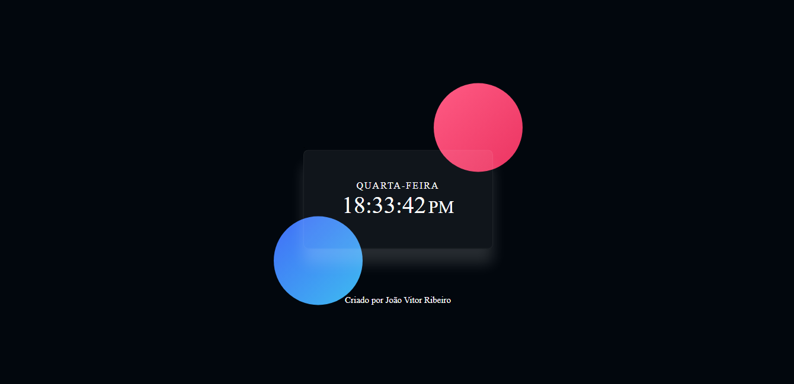

# 🛠 Tecnologias utilizadas:
 

  

  
   
  
  

 

# 💻  Sobre o Projeto:
<li>O Projeto Relógio é uma página web apresenta um relógio digital com o dia da semana e hórario  .</li>
 

# 🎨 Pré-visualização :
## Apresentação do relógio:

# 🦸 Autor:

 
<a href="https://www.linkedin.com/in/jo%C3%A3o-vitor-ribeiro-dias-339a56258/" target="_blank">João Vitor RIbeiro Dias</a>
